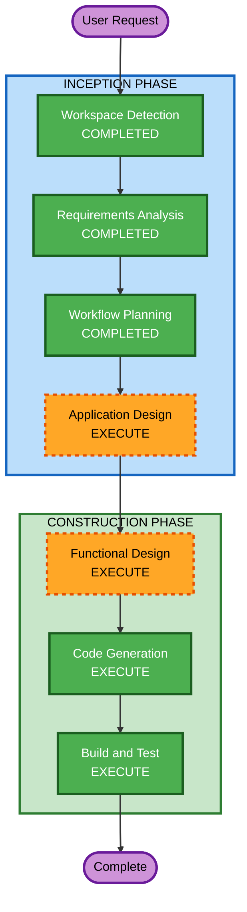

# Execution Plan

## Detailed Analysis Summary

### Change Impact Assessment
- **User-facing changes**: Yes - 고객용 주문 UI + 관리자 대시보드 전체 신규 구축
- **Structural changes**: Yes - 풀스택 Next.js 애플리케이션 신규 아키텍처
- **Data model changes**: Yes - SQLite 기반 7개 엔티티 신규 설계
- **API changes**: Yes - REST API 엔드포인트 + SSE 스트림 신규 구축
- **NFR impact**: No - 소규모 MVP, 별도 NFR 설계 불필요

### Risk Assessment
- **Risk Level**: Low - 소규모 단일 매장 MVP, 로컬 환경 전용
- **Rollback Complexity**: Easy - Greenfield 프로젝트, 기존 시스템 영향 없음
- **Testing Complexity**: Simple - 단일 애플리케이션, 외부 연동 없음

## Workflow Visualization



### Text Alternative
```
INCEPTION PHASE:
  1. Workspace Detection    → COMPLETED
  2. Requirements Analysis  → COMPLETED
  3. User Stories           → EXECUTE
  4. Workflow Planning      → COMPLETED
  5. Application Design    → EXECUTE
  6. Units Generation      → EXECUTE

CONSTRUCTION PHASE:
  7. Functional Design     → EXECUTE
  8. NFR Requirements      → SKIPPED
  9. NFR Design            → SKIPPED
  10. Infrastructure Design → SKIPPED
  11. Code Generation       → EXECUTE
  12. Build and Test        → EXECUTE
```

## Phases to Execute

### INCEPTION PHASE
- [x] Workspace Detection (COMPLETED)
- [x] Requirements Analysis (COMPLETED)
- [x] User Stories - EXECUTE
  - **Rationale**: 사용자 요청에 따라 고객/관리자 페르소나 및 사용자 스토리 문서화
- [x] Workflow Planning (COMPLETED)
- [ ] Application Design - EXECUTE
  - **Rationale**: 풀스택 Next.js 앱의 컴포넌트 구조, API 라우트, 서비스 레이어 설계 필요. 고객용/관리자용 인터페이스 분리, SSE 실시간 통신 구조, 데이터 접근 레이어 등 컴포넌트 간 관계 정의 필요
- [ ] Units Generation - EXECUTE
  - **Rationale**: 사용자 요청에 따라 별도 유닛 분리 진행

### CONSTRUCTION PHASE
- [ ] Functional Design - EXECUTE
  - **Rationale**: 7개 엔티티의 데이터 모델 상세 설계, API 엔드포인트 정의, 주문 상태 전이 로직, 세션 관리 비즈니스 규칙 등 상세 설계 필요
- [ ] NFR Requirements - SKIP
  - **Rationale**: 소규모 로컬 MVP, 별도 성능/보안/확장성 요구사항 설계 불필요. 보안 확장 미적용
- [ ] NFR Design - SKIP
  - **Rationale**: NFR Requirements 미실행으로 건너뜀
- [ ] Infrastructure Design - SKIP
  - **Rationale**: Docker Compose 로컬 환경만 사용, 별도 인프라 설계 불필요
- [ ] Code Generation - EXECUTE (ALWAYS)
  - **Rationale**: 전체 애플리케이션 코드 구현 필요
- [ ] Build and Test - EXECUTE (ALWAYS)
  - **Rationale**: 빌드 및 테스트 검증 필요

### OPERATIONS PHASE
- [ ] Operations - PLACEHOLDER
  - **Rationale**: 향후 배포/모니터링 워크플로우 확장용

## Estimated Timeline
- **Total Stages to Execute**: 6 (User Stories, Application Design, Units Generation, Functional Design, Code Generation, Build and Test)
- **Total Stages Skipped**: 3 (NFR Requirements, NFR Design, Infrastructure Design)

## Success Criteria
- **Primary Goal**: 고객이 테이블에서 메뉴 조회/장바구니/주문을 할 수 있고, 관리자가 실시간으로 주문을 모니터링하고 테이블/메뉴를 관리할 수 있는 MVP 완성
- **Key Deliverables**:
  - Next.js 풀스택 애플리케이션
  - SQLite 데이터베이스 스키마 및 시드 데이터
  - SSE 기반 실시간 주문 알림
  - Docker Compose 로컬 실행 환경
- **Quality Gates**:
  - 모든 API 엔드포인트 정상 동작
  - 고객 주문 플로우 E2E 동작
  - 관리자 대시보드 실시간 업데이트 동작
  - Docker Compose로 로컬 실행 가능
